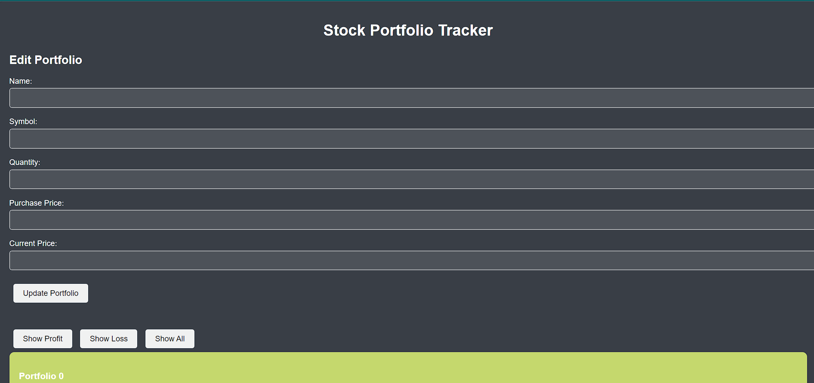
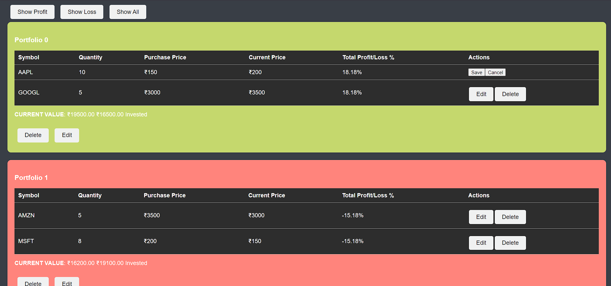

# Stock Market Portfolio Tracker

Welcome to the Stock Market Portfolio Tracker! This web application helps you manage your stock portfolios effortlessly. You can add, update, and delete stocks in your portfolio, keeping track of your investments with ease.

## Features

- **MongoDB Integration:** Utilize MongoDB to store user portfolios and stock information, ensuring efficient data organization.
- **RESTful API Endpoints:** CRUD operations are supported for user portfolios, allowing you to add, update, and delete stocks seamlessly.
- **User-friendly Interfaces:** Intuitive interfaces make it simple to view portfolios and manage stocks. Forms are provided for adding, editing, and deleting stocks.

## Setup

1. **Clone the Repository:** Begin by cloning the repository to your local machine.
```bash
git clone https://github.com/602dhruviii/Stock-Market-Mern.git
```

2. **Install Dependencies:** Navigate to the project directory and install the necessary dependencies.

3. **Configure MongoDB:** Ensure you have MongoDB installed on your system. Configure the connection settings in the application to connect to your MongoDB database.

4. **Start the Server:** Launch the server to run the application.

```bash 
node server.js 
npm start
```

## Usage

1. **View Portfolios:** After logging in, you can view your existing portfolios, if any.

2. **Add Stocks:** To add stocks to a portfolio, navigate to the portfolio and use the provided form to add new stocks.

3. **Update Stocks:** Edit existing stocks in your portfolio by selecting the appropriate options.

4. **Delete Stocks:** Remove unwanted stocks from your portfolio using the delete option.

5. **Manage Portfolios:** Create new portfolios, update existing ones, or delete portfolios as needed.

## Technologies Used

- Node.js
- Express.js
- MongoDB
- HTML/CSS
- JavaScript

## Screenshots
### Update and Add


### View Portfolios

